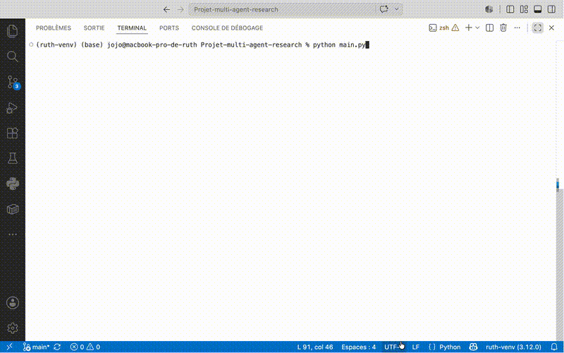

# Multi-Agent Research Assistant

A multi-agent research assistant built with **LangGraph**. It turns a topic into a
structured report by having four specialized agents collaborate over a shared
state, with an automatic revision loop.

## How it works

Four agents run in sequence within a LangGraph graph:

1. **Planner** — breaks the topic down into 3 to 5 research questions.
2. **Researcher** — searches the web (via Tavily) for each question.
3. **Writer** — drafts a structured report from the collected results.
4. **Reviewer** — evaluates the report: approves it, or sends it back to the
   Writer with correction instructions.

The Writer ↔ Reviewer loop is capped by a maximum number of revisions
(`MAX_REVISIONS`, default 2) to prevent infinite loops and keep API costs
under control.

```
START → planner → researcher → writer → reviewer ─┬─→ END
                                  ↑                │
                                  └── (revise) ────┘
```

## Tech stack

- **LangGraph** — agent graph orchestration
- **LangChain + OpenAI** (`langchain-openai`) — agent reasoning
- **Tavily** (`langchain-tavily`) — web search
- **python-dotenv** — API key management
- **Python 3.12**

## Prerequisites

- Python 3.12+
- An **OpenAI** API key (with active credit) — https://platform.openai.com/api-keys
- A **Tavily** API key (free tier is enough for testing) — https://app.tavily.com/

## Installation

```bash
# 1. Clone the repository
git clone https://github.com/<your-username>/multi-agent-research-assistant.git
cd multi-agent-research-assistant

# 2. Create and activate a virtual environment
python3 -m venv venv
source venv/bin/activate        # macOS / Linux
# .\venv\Scripts\activate       # Windows

# 3. Install dependencies
pip install -r requirements.txt
```

## API key configuration

Keys are **never** hard-coded. Create a `.env` file at the project root:

```env
OPENAI_API_KEY=sk-...
TAVILY_API_KEY=tvly-...
```

> **Security**: the `.env` file is listed in `.gitignore` and must **never**
> be committed or pushed to GitHub. If a key is exposed publicly, revoke it
> immediately and generate a new one.

## Usage

```bash
# With the topic as an argument
python main.py The future of remote work

# Without an argument: the program prompts for the topic
python main.py
```

The report is printed to the terminal and saved to a timestamped Markdown file
at the project root (`rapport_<topic>_<date>.md`).

## Project structure

```
multi-agent-research-assistant/
├── config.py          # Initializes the LLM (OpenAI) and the Tavily tool
├── state.py           # Defines the shared state (TypedDict)
├── agents.py          # The 4 agents (planner, researcher, writer, reviewer)
├── graph.py           # LangGraph wiring + conditional routing
├── main.py            # Entry point: execution and saving
├── requirements.txt   # Dependencies
├── .env               # API keys (NOT versioned)
├── .gitignore
└── README.md
```

## Demo




